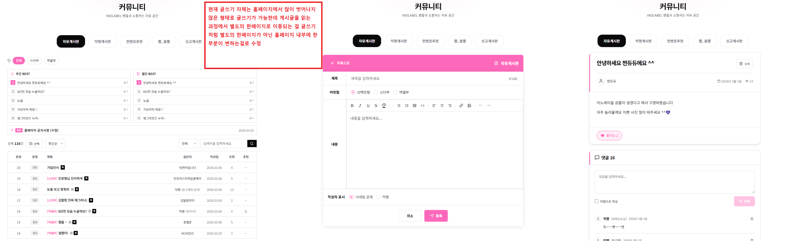

홈페이지 버그수정
1. 게시글 댓글 및 추천이 정상적으로 적용이 안되는 현상
2. 관리자페이지 회원관리에서 회원삭제 시 오류 
삭제 불가
연관된 데이터가 있어 삭제할 수 없습니다. 먼저 연관 데이터를 삭제해주세요.
3. 유투브 연동하는과정에서 하이라이트 영상 뒤에 풀영상이 표시가 되는데 하이라이트 영상만 10개정도 표시되게끔 변경

기능추가 
1. 관리자 페이지 조직도 관리에서 칸을 정할 수 있는 공간을 추가했으면 함 (현재 엑셀부 조직도를 봤을때 대표 / 차장,과장 / 실장 / 사원1...등 처럼 멤버를 나눌수 있는 공간을 조작하는 메뉴)
2. 게시판 개편 (사진으로 설명)

게시글 자체가 이노레이블 홈페이지로 기준잡으면 게시글을 들어갔을때 단독창으로 이동하는데 

https://www.cnine.kr/board/free
https://www.fmkorea.com/starcraft
https://gall.dcinside.com/mini/board/lists?id=inolable

제가 보내드린 예시사이트들에 게시판을 보면 게시판의 단독창이 아닌 ui는 그대로 남아있되 가운데 게시판만 변하는 구조로 되어있습니다 
저희도 약간 이런느낌으로 메뉴에 대한 ui같은것들은 그대로 남겨두고 가운데 글쓰는곳 , 글이 보이는 곳 , 댓글이 보이는곳 게시판기능을 살릴수 있는지에 대해서 말씀드린거에요,

이런식으로 만들어줘!

3. 홈 화면에 자유게시판 인기글을 조금 줄이고 옆에 움짤인기글도 추가하기
4. 마이페이지에서 회원탈퇴 및 삭제 기능 추가
5. 관리자 페이지에 레이블 굿즈샵에 대한 조작페이지 추가 (레이블 굿즈샵같은 제목도 변경할 수 있었으면 함)
https://doublecheckstores.com/88 홈페이지 카테고리에 대한 url을 넣었을때 제품이 유투브 화면표시 되는것처럼 제품들이 나열되서 표시됬으면 함 (즉 크롤링을 해서 가져와 현재 우리 프로젝트에 올리는 구조)

* 
주기적으로 티어표가 변경되는데 삭제하고 수정하고 추가하고 하는데에 있어서 페이지가 계속 새로고침이 되다보니까 하나하나하는게 너무 오래걸려서 혹시나 구글시트에 데이터 입혀놓은거 토대로 한꺼번에 정보를 업데이트한다던지 그런식의 방식은 조금 힘든지 

하나수정하고 페이지 새로고침되고 하나 수정하고 페이지 새로고침되고 << 이방식에서 수정을 싹 하고 적용버튼을 눌러 한꺼번에 적용을 시킨다던지 수정을 해도 페이지 새로고침이 안되는 방식으로도 가능할까요 ?